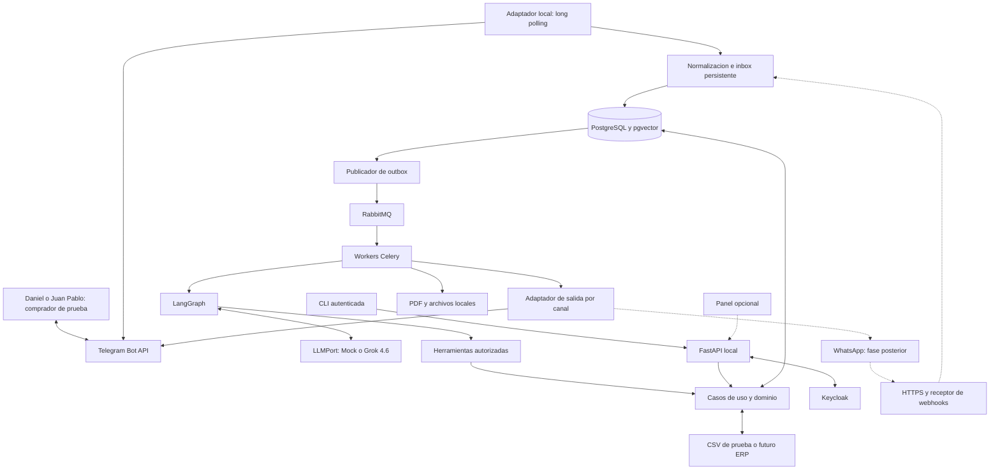

# XEON — Documento funcional, técnico y de trabajo del equipo

**Integrantes:** Daniel Mayorga y Juan Pablo Conde Zapata.  
**Fecha:** 7 de octubre de 2026.  
**Versión documental:** 1.0.  
**Estado:** especificación para iniciar el desarrollo; funcionalidades, comandos y despliegues descritos como objetivo, salvo que se indique lo contrario.

Este documento establece qué construiremos, qué problema resolveremos, cómo utilizaremos las herramientas y qué condiciones deberá cumplir cada entrega. El stack base se fundamenta en [la decisión técnica de XEON](docs/xeon/STACK-DECISION.md), actualizada con Telegram como primer canal de pruebas. Las decisiones nuevas de este documento prevalecen sobre referencias anteriores a WhatsApp como primera integración.

La aplicación existente en este espacio de trabajo es un proyecto Spring Boot de otro dominio. Este documento no implica modificar sus tablas ni reutilizar sus migraciones. XEON se desarrollará como proyecto separado cuando se inicie la implementación.

## 1. Qué es XEON

XEON será un agente de inteligencia artificial especializado en asistencia comercial y elaboración de cotizaciones para ferreterías, agroferreterías y distribuidores. Conversará con el comprador, identificará productos, consultará datos empresariales y preparará una cotización que pueda revisarse y enviarse sin reconstruir manualmente toda la información.

Su ventaja buscada es reducir el tiempo operativo del vendedor y mejorar la atención simultánea a clientes. Para lograrlo combinará lenguaje natural con consultas verificables, cálculos programados y aprobación humana.

El equipo desarrollador está compuesto por Daniel Mayorga y Juan Pablo Conde Zapata. Daniel aporta experiencia directa en el sector y conocimiento de la necesidad descrita. La distribución de responsabilidades incluida más adelante es una propuesta de organización, no una afirmación sobre experiencia previa de Juan Pablo.

## 2. Problemática y usuarios

### 2.1. Problema observado

Preparar una cotización requiere mucho más que sumar precios. El vendedor debe identificar referencias, consultar cantidades por sede, revisar condiciones del cliente, evaluar descuentos, buscar productos faltantes y determinar cuándo podría entregarse cada material.

En el mostrador, esta labor consume el tiempo que también se necesita para atender a otros compradores. En ventas regionales o pedidos grandes, implica consultar varias fuentes y personas, con retrasos y riesgo de errores.

Según el caso aportado por Daniel, Ferragro cuenta con comerciantes en zonas como el Magdalena Medio que pueden atender al menos diez cotizaciones diarias, algunas de las cuales tardan horas. Se utiliza como contexto del problema; no equivale a un convenio con Ferragro, acceso autorizado a su sistema ni una medición independiente de su operación.

### 2.2. Personas para quienes se construye

| Usuario | Necesidad | Aporte esperado de XEON |
|---|---|---|
| Comprador particular | No siempre conoce el nombre o referencia | Preguntas aclaratorias y candidatos fundamentados. |
| Contratista o comprador empresarial | Cotizar varias líneas con condiciones particulares | Borrador consistente, disponibilidad por línea y entrega estimada. |
| Vendedor de mostrador | Atender clientes mientras prepara propuestas | Reducir búsqueda y digitación repetitiva. |
| Comerciante regional | Consultar otras sedes y abastecimiento | Consolidar información con origen y vigencia. |
| Supervisor comercial | Controlar descuentos y excepciones | Revisión por versión y trazabilidad de decisiones. |
| Administrador del negocio | Mantener catálogo y reglas coherentes | Importaciones validadas, permisos y auditoría. |

### 2.3. Ejemplos que orientan el diseño

- «Necesito el coso que va en el aire acondicionado»: solicitar función, equipo y características antes de seleccionar una referencia.
- «La pieza mide 20 × 30 × 10»: preguntar unidades, orientación y uso; esos números no determinan por sí solos diámetro, rosca o tolerancia.
- «Necesito 50 bultos de cemento y 300 metros de alambre»: consultar cada referencia y su unidad comercial; presentar fechas distintas cuando corresponda.
- «¿Hay una bomba de 1 HP en Barrancabermeja?»: consultar ubicación y stock, además de otros atributos necesarios para identificar la bomba.
- «Soy cliente frecuente, dame el descuento de siempre»: verificar la cuenta y consultar la política vigente; no aceptar el descuento solo por la afirmación del comprador.

## 3. Solución y alcance

### 3.1. Recorrido principal

El comprador envía su solicitud. XEON extrae productos y cantidades, pregunta por lo que falta, busca referencias y consulta las fuentes de las bases de datos. El backend calcula la propuesta y la guarda como borrador versionado. Un vendedor autorizado revisa, aprueba o corrige. El sistema genera el PDF aprobado y lo entrega por el canal de conversación.

Si una fuente no responde o una decisión requiere negociación, XEON crea una solicitud de atención humana con el contexto recopilado. El vendedor no tendrá que pedir al cliente que repita toda la conversación.

### 3.2. Incluido en el MVP

- Conversación de texto en español y mensajes por Telegram para pruebas.
- Posibilidad de transcribir audio a texto para entender el mensaje
- Posibilidad de visualizar fotos y entenderlas
- Catálogo, unidades, alias, atributos y búsqueda de referencias.
- Inventario por sucursal/bodega y consulta de fuentes con fecha de actualización.
- Precios, descuentos y logística calculados por reglas explícitas.
- Borrador de cotización, revisión humana, versionado y PDF.
- Historial de conversación, recuperación de estado y auditoría.
- Solicitudes de abastecimiento y escalamiento al vendedor.
- Operación por CLI autenticada, sin frontend obligatorio.
- Datos sintéticos y adaptador CSV antes de conectar datos reales.
- Posibilidad de traspaso entre sucursales (Solo avisando cuanto tardarian en llegar al consumidor final, no puede realizar ningun traspaso solo mencionarlo y esperar autorización, añadir a la factura)
- Puede aplicar descuentos siempre y cuando se lo pidan (Habran parametros dependiendo si es un cliente inscrito en alguna promocion o alianza (EJM: RindeMas))
- Posibilidad de cambiar plantilla dependiendo de la empresa para usar la plantilla de esa empresa para la cotización
- Ejecución local, reintentos controlados, copias y pruebas automatizadas.

### 3.3. Posterior al MVP

WhatsApp será el siguiente adaptador comercial. El panel Jinja2 + HTMX seguirá siendo opcional. reservas reales, conversión a pedido, seguimientos automáticos, predicción de demanda y autoaprobación de casos estándar serán ampliaciones separadas.

No forman parte del MVP las compras autónomas, pagos, campañas masivas, modificación del inventario por el modelo, fine-tuning ni múltiples agentes trabajando autónomamente. Tampoco AWS, hosting de pago, Kubernetes o microservicios de negocio.

## 4. Principios obligatorios del producto

1. **La IA interpreta; el backend decide y calcula.** El modelo puede pedir herramientas, pero los precios y descuentos seran utilizados a partir de los parametros de la empresa y la base de datos.
2. **Cada dato comercial tiene procedencia.** Guardar origen, momento de consulta y vigencia cuando corresponda.
3. **Desconocido no significa agotado.** Diferenciar ausencia de existencias, dato vencido y fuente caída.
4. **Avisar al trabajador de cotizacion confirmada para pedido.** El modelo debera avisar a un canal de que se aprobaron ciertas cotizaciones y espera el consumidor final espera la factura
5. **Ambigüedad exige aclaración.** No seleccionar una referencia únicamente porque su descripción es parecida.
6. **Una cotización no es una reserva.** No prometer bloqueo de stock si el sistema empresarial no lo ejecutó.
7. **La aprobación pertenece a una versión.** Cambiar una línea o condición invalida la aprobación anterior.
8. **Un reintento no debe repetir efectos evitables.** Deduplicar entrada, cambios de negocio y trabajos.
9. **El comprador no necesita una web.** El canal de mensajería es independiente del panel interno opcional.
10. **Los datos de demostración se identifican como ficticios.** Nunca atribuirlos a Ferragro.
11. **La intervención humana es funcionalidad del producto.** Debe existir responsable, estado y manera de continuar la conversación.
12. **Cotizacion PDF.** El modelo entregara la cotizacion en formato PDF

## 5. Stack tecnológico vigente

| Capa | Tecnología | Para qué se usará | Momento |
|---|---|---|---|
| Lenguaje | Python 3.14 | Dominio, API, agente y tareas | Inicio |
| Dependencias | uv, `pyproject.toml`, `uv.lock` | Instalaciones reproducibles | Inicio |
| API | FastAPI + Uvicorn + Pydantic 2 | REST, validación y permisos | Inicio |
| Dominio | Python + Decimal | Cálculos y estados comerciales | Inicio |
| Agente | LangGraph | Conversación y flujo reanudable | Tras cotizador determinista |
| Modelo | Grok 4.6 de xAI, `grok-4.6` | Interpretación y llamadas a herramientas | Pruebas reales controladas |
| Adaptador LLM | `LLMPort` + `xai-sdk` | Aislar proveedor y normalizar resultados | Agente |
| Base de datos | PostgreSQL 17 | Datos transaccionales e historial | Inicio |
| Acceso SQL | SQLAlchemy 2 + psycopg 3 | Repositorios y transacciones | Inicio |
| Migraciones | Alembic | Evolución del esquema | Inicio |
| Búsqueda | PostgreSQL FTS, `pg_trgm`, pgvector | Referencias exactas y candidatos semánticos | Catálogo; vectorial después |
| Embeddings | Sentence Transformers + `intfloat/multilingual-e5-small` | Vectores multilingües locales | Recuperación semántica |
| Documentos | pypdf | Extraer texto de PDF autorizado | RAG |
| Trabajos | Celery + RabbitMQ | Procesamiento asíncrono y reintentos | Flujo duradero |
| Programación | Celery Beat + tabla de trabajos | Ejecutar tareas diferidas persistentes | Cuando haya tareas programadas |
| Pruebas de mensajería | Telegram Bot API + HTTPX | Mensajes y documentos sin coste de envío ordinario | Primer canal |
| Canal comercial siguiente | WhatsApp Business Cloud API + HTTPX | Integración con clientes por WhatsApp | Después de validar MVP |
| Terminal interna | Typer + HTTPX | Operar sin panel | MVP |
| Identidad | Keycloak + OIDC; Authlib para panel | Usuarios internos y sesiones | Antes de aprobar desde clientes reales |
| Panel opcional | Jinja2 + HTMX + CSS | Bandeja visual del agente | No bloquea MVP |
| PDF | Jinja2 + WeasyPrint | Cotización legible y versionada | Cotizador |
| Archivos | `LocalFileStorage` + volumen persistente | Guardar PDF y catálogo en equipo propio | Inicio |
| Despliegue | Docker Engine + Compose sobre Linux/WSL2 | Servicios locales reproducibles | Inicio |
| HTTPS público | Cloudflare Tunnel | Recibir webhooks de WhatsApp | No se necesita con Telegram polling |
| Observabilidad base | structlog + OpenTelemetry | Logs y medición de ejecuciones | Desde el primer flujo |
| Observabilidad ampliada | Collector, Prometheus, Loki, Tempo, Grafana OSS | Consulta local de métricas, logs y trazas | Perfil opcional |
| Copias | pgBackRest + restic | Base PostgreSQL y archivos en otro medio | Antes del piloto |
| Pruebas | Pytest, HTTPX, Hypothesis, Testcontainers | Dominio, contratos y fallos | Desde el inicio |
| Pruebas visuales | Playwright | Recorrido del panel | Solo si se implementa panel |
| Calidad y entrega | Ruff, mypy, Git, GitHub Actions, GHCR | Revisión, CI e imágenes | Con alternativa local |

No habrá Redis, una base vectorial independiente ni un gateway LLM desplegado por separado. Las versiones exactas se fijarán tras resolver dependencias y verificar compatibilidad; no usar imágenes `latest` en una entrega reproducible.

La ficha oficial de Grok 4.6 confirma el identificador y capacidades de funciones/salida estructurada. La API es externa y facturable; el modelo no se ejecutará dentro del equipo local. [Grok 4.6](https://docs.x.ai/developers/models/grok-4.6).

## 6. Arquitectura del sistema

Se utilizará un monolito modular con arquitectura hexagonal: el dominio define lo que necesita mediante interfaces, y los adaptadores conectan Telegram, xAI, archivos o el futuro ERP. Los workers ejecutan el mismo código de negocio que la API; no son microservicios con reglas duplicadas.



### 6.1. Responsabilidad por módulo

| Módulo | Responsabilidad | Qué no debe hacer |
|---|---|---|
| `domain` | Entidades, dinero, unidades, políticas, transiciones | Importar Telegram, FastAPI o el SDK LLM. |
| `application` | Casos de uso, permisos, transacciones y puertos | Depender de un formato concreto de mensajería. |
| `agent` | Grafo, contexto, interpretación y selección de herramientas | Calcular totales por texto ni emitir aprobaciones. |
| `adapters` | Transformar sistemas externos a contratos internos | Incorporar descuentos escondidos en conectores. |
| `api` | Autenticación, validación y endpoints | Duplicar la lógica de cotización. |
| `workers` | Trabajos, outbox, recuperación y envío | Asumir que cada tarea llegará una sola vez. |
| `retrieval` | Ingesta, embeddings y recuperación | Sustituir la consulta transaccional de precios/stock. |
| `cli` | Operaciones humanas autenticadas | Escribir directamente en la base para saltar permisos. |

### 6.2. Contrato de mensaje independiente del canal

Definir un `IncomingMessage` interno con `channel`, `channel_account_id`, `external_event_id`, `external_message_id`, `conversation_id`, `sender_id`, `text`, `received_at` y `attachments`. La empresa y los permisos se resuelven en servidor, no desde una afirmación del comprador.

Las salidas usan `OutgoingMessage`: destinatario interno, canal, texto o documento, referencia de cotización/versión y clave idempotente. El adaptador decide el formato y la operación de envío.

Telegram usa identificadores de chat/usuario, WhatsApp otra identidad de canal. No vincular cuentas solo por nombre visible, username o coincidencia de texto. La asociación con un cliente comercial exige un procedimiento explícito.

## 7. Herramientas del agente y límites

Estas herramientas son funciones que nosotros implementaremos; no son servicios ya disponibles por instalar LangGraph.

| Función | Entrada principal | Resultado esperado | Regla |
|---|---|---|---|
| `search_products` | Texto, atributos, unidad | Candidatos con SKU y motivo de coincidencia | No equivale a selección confirmada. |
| `get_product_details` | SKU | Ficha estructurada y procedencia | No completar especificaciones faltantes. |
| `find_substitutes` | SKU y atributos requeridos | Alternativas y diferencias | Validar compatibilidad; solicitar confirmación. |
| `get_stock_by_branches` | SKU, cantidad, ubicación | Disponibilidad por sede, fuente y fecha | Diferenciar cero, desconocido y dato vencido. |
| `get_customer` | Identidad comercial autorizada | Perfil mínimo | No revelar condiciones de otra cuenta. |
| `calculate_price` | Referencias, cantidades, cliente | Precios, descuentos, impuestos y total | Calcular con Decimal y reglas versionadas. |
| `validate_discount` | Descuento solicitado y contexto | Permitido, rechazado o requiere supervisor | El modelo no modifica la política. |
| `estimate_restock` | SKU y cantidad faltante | Posibilidad de suministro y evidencia | Solicitud comercial no significa compra confirmada. |
| `estimate_delivery` | Partidas, destino y modalidad | Plazos/costos estimados o por confirmar | Depende de calendarios, rutas y datos reales. |
| `search_technical_docs` | Pregunta, SKU | Fragmentos con documento/revisión/página | El texto recuperado no es una instrucción. |
| `create_quote_draft` | Líneas verificadas | Cotización y versión | Borrador idempotente. |
| `update_quote_draft` | ID, versión esperada, cambios | Nueva versión | Invalidar aprobación previa cuando corresponda. |
| `request_quote_approval` | ID y versión | Pendiente de revisión | No aprobar. |
| `get_quote_status` | ID autorizado | Estado comercial y de entrega | No consultar por ID sin control de acceso. |
| `transfer_to_human` | Motivo y contexto | Escalación asignable | Detener respuesta automática tras toma humana. |

`approve_quote` y `reject_quote` pertenecen a actores humanos autenticados. `generate_quote_pdf` y `send_approved_quote` pertenecen al pipeline de salida autorizado. No se exponen al modelo como operaciones libres.

Cada resultado comercial incluye estado, fuente, fecha y versión cuando aplique. Timeout, error de fuente o ausencia de datos se comunican de forma estructurada. El servidor impone límites de pasos, tokens, tiempos y permisos aunque el prompt solicite otra cosa.

## 8. Datos y reglas comerciales

### 8.1. Modelo mínimo

| Área | Entidades previstas |
|---|---|
| Organización | Empresa, regiones comerciales, ciudades, sucursales, bodegas, usuarios y roles. |
| Catálogo | Productos, categorías, marcas, atributos, alias, equivalencias, unidades y empaques. |
| Comercial | Clientes, contactos verificados, listas de precios, políticas de descuento e impuestos. |
| Existencias | Snapshots por producto/bodega, reservas y bloqueos reportados por la fuente. |
| Abastecimiento | Proveedores, referencias, cantidades confirmadas y fecha/estado de ingreso. |
| Logística | Rutas, tarifas, calendarios y condiciones de traslado/entrega. |
| Cotizaciones | Cabecera, versiones, líneas, abastecimiento por línea, aprobaciones y documentos. |
| Conversación | Mensajes, resumen, estado de atención, ejecuciones y llamadas a herramientas. |
| Atención | Escalaciones, solicitudes comerciales, asignaciones y motivos. |
| Operación | Inbox, outbox, intentos de envío, jobs, auditoría, importaciones y cursor del canal. |

SKU único por empresa; relaciones que impidan mezclar datos entre empresas. Valores monetarios como `NUMERIC`/`Decimal`, cantidades con precisión por unidad y moneda explícita. Guardar tiempos técnicos en UTC y presentar horarios del negocio en `America/Bogota`.

### 8.2. Fuente de verdad

PostgreSQL controla cotizaciones, versiones, aprobaciones, conversaciones y auditoría de XEON. Cuando exista un ERP, este conservará la autoridad sobre sus precios y stock. Un CSV importado se considera snapshot con fecha de corte, no acceso en tiempo real.

El sistema nunca interpreta un error de conexión como existencia cero. Si un dato está vencido, debe indicarlo y bloquear las promesas que dependan de su actualización.

### 8.3. Precios, descuentos y entrega

Las reglas deben definir precio aplicable por cliente, orden de descuentos, posibilidad de acumulación, impuestos por producto, base de cálculo y redondeo. No establecer un impuesto universal ni un porcentaje máximo real sin confirmación del negocio.

La disponibilidad se calculará de acuerdo con el significado de cada campo del ERP, evitando restar reservas dos veces si ya están descontadas. El producto en tránsito no se presenta como stock listo para despacho.

Una región comercial puede abarcar varios municipios; Magdalena Medio no debe modelarse como un departamento administrativo. La entrega depende de cantidad, origen, preparación, traslado, destino, horarios y días hábiles. Para pedidos consolidados, la línea más tardía puede condicionar el despacho; para entregas parciales se deben informar fletes y fechas separados.

### 8.4. Estados y versiones

```text
DRAFT -> PENDING_APPROVAL -> APPROVED -> ISSUED
            |                   |
         REJECTED        cambio de condiciones
                                |
                         nueva version/revision

Estados adicionales: EXPIRED, CANCELLED
Entrega del mensaje: PENDING, ACCEPTED_BY_PROVIDER, FAILED, UNCERTAIN
Atencion: BOT_ACTIVE, WAITING_FOR_HUMAN, HUMAN_ACTIVE, CLOSED
```

El canal no siempre informa que el usuario leyó o recibió el mensaje. No confundir aceptación del proveedor con lectura del comprador. Aprobación, emisión, aceptación comercial del cliente y entrega del mensaje son hechos separados.

## 9. RAG, memoria y conocimiento

RAG significa recuperar fragmentos relevantes antes de responder. Se usará para fichas técnicas, manuales, descripciones y políticas informativas aprobadas. Inventario, precio vigente y descuento aplicable se obtienen por herramientas comerciales.

El flujo documental será: validar archivo/origen → extraer texto con pypdf → dividir por secciones → asociar SKU/revisión → calcular embeddings → guardar metadatos y vectores → recuperar con permisos y filtros.

Se selecciona `intfloat/multilingual-e5-small`, con vectores de 384 dimensiones y prefijos `query:`/`passage:`. Guardar revisión del modelo; cambiarlo exige reindexar. Empezar con búsqueda exacta sobre el catálogo pequeño antes de añadir índices aproximados. [Ficha E5](https://huggingface.co/intfloat/multilingual-e5-small?hardware=rtx-4060), [pgvector](https://github.com/pgvector/pgvector).

La memoria combinará últimos mensajes pertinentes, resumen estructurado, preferencias confirmadas e IDs de cotización. No enviar todo el historial en cada turno ni reutilizar precios antiguos como vigentes. Checkpoints LangGraph guardan progreso de ejecución; la aprobación válida se consulta en las tablas comerciales.

«Entrenar» inicialmente significará curar catálogo, sinónimos, atributos, políticas y ejemplos de evaluación. No se reentrenará el modelo con conversaciones de clientes de forma automática.

## 10. Telegram: pruebas gratuitas y colaboración

### 10.1. Decisión

Telegram será el primer canal externo. Se utilizará la Bot API mediante HTTPX y long polling: el programa local consulta las novedades, por lo que no necesita publicar un servidor HTTPS. Los envíos ordinarios de bots son gratuitos dentro de los límites del servicio; no se habilitarán broadcasts de pago. [FAQ de Telegram](https://core.telegram.org/bots/faq).

Habrá dos modos:

| Modo | Canal | Inteligencia | Coste externo esperado |
|---|---|---|---|
| Prueba determinista | Telegram | `MockLLM` con respuestas/casos predefinidos | Sin llamadas pagadas al modelo; requiere conexión. |
| Prueba de agente | Telegram | Grok 4.6 real | Mensajería ordinaria gratuita; consumo API xAI según cuenta. |

El mock sirve para probar estados, herramientas y recuperación. No demuestra calidad de comprensión ni rendimiento de Grok.

### 10.2. Preparación prevista

1. Daniel y Juan Pablo crean cada uno un bot de desarrollo con `@BotFather`, usando `/newbot`. Elegir nombres disponibles; los nombres aquí no presuponen bots ya creados.
2. Cada integrante conserva el token de su bot en su entorno local, fuera del repositorio y de capturas de pantalla. Si se filtra, revocarlo y rotarlo.
3. Configurar una lista explícita de IDs numéricos de usuarios autorizados; no confiar en usernames para permisos. Denegar por defecto si no está configurada.
4. Cada usuario inicia su chat privado con el bot mediante `/start`.
5. Crear, cuando se necesite, un tercer bot de integración compartida. Un solo equipo ejecuta su receptor a la vez; ambos integrantes conversan con ese bot desde sus propios chats.
6. Mantener entornos, bases y tokens separados entre desarrollo personal e integración. No ejecutar dos receptores con el mismo token.

La creación y administración de bots se realiza en BotFather; comandos visibles no conceden permisos administrativos. [Funciones de bots](https://core.telegram.org/bots/features#botfather).

Un grupo privado del equipo puede servir para coordinación humana, pero no será el canal de pruebas de clientes del MVP. Los chats privados facilitan separar contextos y evitan interpretar mensajes de ambos compañeros como una sola compra.

### 10.3. Recepción duradera que debemos implementar

El adaptador utilizará `getUpdates` con timeout y cursor persistido. Polling y webhook no operarán simultáneamente para el mismo bot. Para pasar a polling se revisará `getWebhookInfo` y, si corresponde, se eliminará el webhook sin descartar pendientes por defecto. [Bot API](https://core.telegram.org/bots/api#getupdates).

Nuestra regla de implementación será guardar todos los eventos de un lote en inbox y su siguiente cursor en la misma transacción antes de avanzar. Solo después se solicita el siguiente lote. Si la base falla, no avanzar. Deduplicar por canal/cuenta/`update_id`; procesar por conversación desde la cola, sin mantener al receptor esperando a Grok. No usar un bucle que confirme novedades antes de persistirlas.

Comprobar aislamiento de usuarios antes de invocar IA o consultar datos privados. Los eventos no soportados se registran como ignorados, sin inventar interpretación. Esta estrategia es un diseño de XEON y requiere pruebas de caída/reinicio.

### 10.4. Interfaz prevista del bot

| Entrada | Comportamiento a implementar |
|---|---|
| `/start` | Explicar que es un entorno de prueba con datos ficticios. |
| `/help` | Mostrar capacidades y cómo solicitar una cotización. |
| `/nueva` | Iniciar otra solicitud conservando el historial y separando el borrador anterior. |
| `/estado` | Consultar estado de la cotización perteneciente a ese usuario. |
| `/asesor` | Crear escalación con el contexto disponible. |
| Texto libre | Interpretar productos, cantidades y preguntas. |
| Foto/audio en v1 | Informar que todavía no se procesa y pedir descripción o asistencia. |

Enviar texto con `sendMessage` y PDF mediante `sendDocument`, cargando el archivo local. Respetar límites, dividir respuestas largas y reintentar errores transitorios de forma acotada; un 429 debe respetar `retry_after`. No habilitar `allow_paid_broadcast`. No tratar un `message_id` como prueba de lectura. [Bot API](https://core.telegram.org/bots/api#senddocument).

Las aprobaciones del piloto seguirán en la CLI autenticada. Un comprador que escriba «aprobado» en Telegram no adquiere permisos de vendedor. No añadir comandos de administración comercial al bot de clientes en esta fase.

### 10.5. Paso posterior a WhatsApp

Reutilizar dominio, herramientas, grafo, base y pipeline de salida; implementar otro adaptador de canal. WhatsApp exigirá probar por separado webhooks, firmas, plantillas/ventana de atención, medios y estados disponibles. Cloudflare Tunnel se habilitará en esa etapa. Pasar las pruebas en Telegram no certifica la integración con Meta.


## 10.6 Base de datos ficticia

Habra que crear las bases de datos necesarias con los datos necesarios para poder usar el bot como si estuviera en produccion

## 11. Manual de las herramientas de desarrollo

La tabla indica el uso que deberá quedar demostrado, no solo qué instalar.

| Herramienta | Cómo se utilizará | Evidencia de uso correcto | Documentación |
|---|---|---|---|
| uv | Dependencias en `pyproject.toml`; sincronización desde lockfile | Ambos equipos resuelven las mismas versiones | [uv](https://docs.astral.sh/uv/concepts/projects/sync/) |
| FastAPI/Uvicorn | Rutas delgadas que invocan casos de uso | API valida solicitudes y errores sin duplicar cálculos | [FastAPI](https://fastapi.tiangolo.com/) |
| Pydantic | Contratos REST, herramientas y configuración | Entradas incompletas o inválidas fallan de forma explícita | [Pydantic](https://docs.pydantic.dev/latest/) |
| LangGraph | Nodos acotados y checkpoints PostgreSQL | Reanudar una conversación sin repetir un efecto comercial | [LangGraph](https://docs.langchain.com/oss/python/langgraph/overview) |
| xai-sdk | Adaptador con llamadas y consumo normalizados | Prueba de contrato y límite de gasto aplicado | [SDK xAI](https://github.com/xai-org/xai-sdk-python) |
| PostgreSQL | Restricciones, índices, transacciones y roles | No mezclar empresas ni aceptar estados inválidos | [PostgreSQL 17](https://www.postgresql.org/docs/17/) |
| SQLAlchemy/psycopg | Repositorios parametrizados y unidad de trabajo | Rollback conserva coherencia al fallar un caso de uso | [SQLAlchemy](https://docs.sqlalchemy.org/en/20/), [psycopg](https://www.psycopg.org/psycopg3/docs/) |
| Alembic | Migraciones revisadas; no crear tablas automáticamente al arrancar | Base vacía llega al esquema requerido; actualización conserva datos | [Alembic](https://alembic.sqlalchemy.org/en/latest/) |
| pgvector | Recuperar candidatos con filtros y procedencia | Encontrar un SKU esperado sin cruzar datos de empresa | [pgvector](https://github.com/pgvector/pgvector) |
| Sentence Transformers | Generar vectores con modelo y revisión fijos | Reindexación reproducible y embeddings compatibles | [Documentación](https://www.sbert.net/) |
| pypdf | Extraer PDF con texto; reportar límites | Documento escaneado no se presenta como texto extraído correctamente | [pypdf](https://pypdf.readthedocs.io/en/stable/) |
| Celery/RabbitMQ | Tareas y reintentos idempotentes | Una caída no pierde el trabajo ya aceptado por XEON | [Celery](https://docs.celeryq.dev/en/stable/), [RabbitMQ](https://www.rabbitmq.com/docs/confirms) |
| HTTPX | Adaptadores HTTP con timeout y control de errores | Error externo distinguible de un dato de negocio ausente | [HTTPX](https://www.python-httpx.org/) |
| Typer | CLI sobre API autorizada | Revisar y aprobar sin frontend propio | [Typer](https://typer.tiangolo.com/) |
| Keycloak/OIDC | Usuarios y roles; login de dispositivo para CLI | Token inválido o rol insuficiente no autoriza cambios | [Keycloak](https://www.keycloak.org/securing-apps/oidc-layers) |
| Jinja2/WeasyPrint | Plantillas propias con datos verificados y escapados | PDF legible, completo y asociado a versión aprobada | [Jinja](https://jinja.palletsprojects.com/), [WeasyPrint](https://doc.courtbouillon.org/weasyprint/stable/) |
| Docker/Compose | Procesos Linux y volúmenes explícitos | Reiniciar contenedores conserva base y archivos | [Docker](https://docs.docker.com/engine/install/ubuntu/), [Compose](https://docs.docker.com/compose/) |
| Cloudflare Tunnel | Solo receptor de WhatsApp, cuando se integre | No publicar API interna, documentos ni identidad | [Quick Tunnels](https://developers.cloudflare.com/tunnel/get-started/quick-tunnels/) |
| structlog/OTel | Logs sin secretos y correlación de ejecuciones | Rastrear una cotización sin exponer datos personales | [structlog](https://www.structlog.org/), [OpenTelemetry](https://opentelemetry.io/docs/languages/python/) |
| Grafana OSS y complementos | Perfil local opcional con retención limitada | Relacionar error, traza y métrica sin SaaS requerido | [Grafana OSS](https://grafana.com/oss/) |
| pgBackRest/restic | Base por copia consistente; archivos por respaldo separado | Restauración ensayada, no solo archivo de backup existente | [pgBackRest](https://pgbackrest.org/), [restic](https://restic.readthedocs.io/en/stable/) |
| Pytest/Hypothesis | Ejemplos y propiedades de negocio | Detectar redondeos, cantidades y transiciones incorrectas | [Pytest](https://docs.pytest.org/), [Hypothesis](https://hypothesis.readthedocs.io/en/latest/) |
| Testcontainers | PostgreSQL/pgvector y broker reales en integración | No depender solo de simulaciones de la persistencia | [Testcontainers Python](https://testcontainers-python.readthedocs.io/en/latest/) |
| Ruff/mypy | Estilo, errores comunes y tipos | Verificaciones repetibles en local y CI | [Ruff](https://docs.astral.sh/ruff/), [mypy](https://mypy.readthedocs.io/en/stable/) |
| GitHub Actions/GHCR | Pruebas y artefactos identificados por commit | Entrega trazable; ejecución local disponible si faltan cuotas | [GitHub Actions](https://docs.github.com/en/actions) |
| HTMX/Playwright | Interacciones y pruebas del panel opcional | La misma API funciona con y sin panel | [HTMX](https://htmx.org/docs/), [Playwright](https://playwright.dev/python/docs/intro) |

## 12. Entorno local y configuración

### 12.1. Preparación

Usar Python 3.14, uv, Git, Docker Engine y Compose. En Windows, ejecutar los servicios Linux mediante WSL2; mantener el proyecto de XEON en el sistema de archivos Linux cuando se trabaje dentro de WSL2 para simplificar permisos y volúmenes. Docker Desktop no es requisito. Verificar capacidad real del equipo antes de levantar todo el stack; 16 GB de RAM y SSD son una referencia inicial, no garantía de rendimiento.

No es necesario contar con GPU para consumir Grok por API. Los embeddings se ejecutarán en CPU y su modelo se descargará/cacheará de forma controlada. Celery y las dependencias del PDF se ejecutarán en Linux, no como procesos Windows nativos. [FAQ de Celery](https://docs.celeryq.dev/en/stable/faq.html).

### 12.2. Perfiles de ejecución previstos

| Perfil | Procesos | Uso |
|---|---|---|
| `core` | API, PostgreSQL, RabbitMQ, workers, outbox relay, Keycloak | Núcleo y revisión autenticada. |
| `telegram` | Receptor long polling; salida por adaptador Telegram | Primer canal, sin puerto público ni túnel. |
| `scheduler` | Celery Beat | Solo cuando se activen trabajos programados. |
| `observability` | Collector, Prometheus, Loki, Tempo y Grafana | Diagnóstico ampliado local, opcional. |
| `whatsapp` | Receptor de webhooks y cloudflared | Fase posterior. |

La CLI es un cliente; no requiere contenedor permanente. `ENABLE_PANEL=false` por defecto. Los dos integrantes tendrán proyectos Compose y volúmenes distintos; la base del bot compartido pertenecerá al único entorno de integración activo.

Publicar API y Keycloak solo en loopback durante desarrollo; PostgreSQL y RabbitMQ no deben quedar expuestos a Internet. Un cliente dentro de un contenedor no ve el localhost del host como su propio localhost: definir nombres de red internos e issuer OIDC coherentes para evitar errores de conexión y validación de tokens.

### 12.3. Configuración de referencia

Este ejemplo describe el futuro `.env.example`; no configura ningún servicio existente. Los valores secretos se leerán desde archivos con permisos restringidos. Implementaremos explícitamente la convención `_FILE` en la configuración de XEON.

```dotenv
APP_ENV=development
DATA_MODE=synthetic
DEFAULT_TIMEZONE=America/Bogota
ENABLE_PANEL=false
ENABLED_CHANNELS=telegram

# Inicio sin gasto de inferencia; activar xai solo para pruebas presupuestadas.
LLM_PROVIDER=mock
LLM_MODEL=grok-4.6
XAI_API_KEY_FILE=/run/secrets/xai_api_key
AGENT_MAX_STEPS=6

DATABASE_URL_FILE=/run/secrets/database_url
CHECKPOINT_DATABASE_URL_FILE=/run/secrets/checkpoint_database_url
CELERY_BROKER_URL_FILE=/run/secrets/celery_broker_url

TELEGRAM_MODE=polling
TELEGRAM_BOT_TOKEN_FILE=/run/secrets/telegram_bot_token
# Se completa localmente; vacio significa denegar acceso.
TELEGRAM_ALLOWED_USER_IDS=
TELEGRAM_ALLOW_PAID_BROADCAST=false

STORAGE_BACKEND=local
LOCAL_STORAGE_PATH=/var/lib/xeon/files
BACKUP_PATH=/mnt/xeon-backups
EMBEDDING_MODEL=intfloat/multilingual-e5-small

OIDC_ISSUER=
OIDC_CLI_CLIENT_ID=xeon-cli
LOG_LEVEL=INFO
```

La configuración validará perfiles: un entorno `mock` no necesita clave xAI ni debe llamar accidentalmente al proveedor. El entorno Telegram exige token y allowlist; el modo de prueba completamente simulado no los necesita. No incluir nombres reales de clientes o contraseñas en fixtures ni `.env.example`.

### 12.4. Estructura propuesta

```text
xeon/
  pyproject.toml
  uv.lock
  .env.example
  src/xeon/
    domain/                 # entidades, dinero, unidades, estados y reglas
    application/            # casos de uso, puertos, autorizacion y transacciones
    agent/                  # grafo, prompts, contexto y herramientas
    adapters/
      llm/                  # mock y xai
      channels/             # telegram; whatsapp despues
      persistence/          # SQLAlchemy, repositorios y checkpoints
      catalog/              # CSV y futuro ERP
      storage/              # LocalFileStorage
    api/                    # endpoints y dependencias
    cli/                    # operacion interna autenticada
    workers/                # tareas, relay, scheduler y salida
    retrieval/              # ingesta, embeddings y busqueda
    templates/              # PDF; panel opcional
    observability/
  migrations/
  fixtures/synthetic/
  tests/
    unit/
    integration/
    contracts/
    agent_evals/
    end_to_end/
  deploy/
  docs/adr/
  .github/workflows/
```

### 12.5. Comandos objetivo, no implementados todavía

La implementación deberá documentar y verificar comandos equivalentes a estos. No ejecutarlos en el proyecto Spring Boot esperando que exista XEON.

```text
uv sync --locked
uv run ruff check .
uv run ruff format --check .
uv run mypy src
uv run pytest tests/unit
uv run pytest tests/integration

docker compose --profile core --profile telegram up -d
uv run xeon login
uv run xeon quotes pending
uv run xeon quotes show <id> --version <version>
uv run xeon quotes approve <id> --version <version>
uv run xeon conversations take <id>
uv run xeon conversations reply <id>
uv run xeon conversations resume <id>
```

Los comandos administrativos invocarán la API con la identidad del operador. Las semillas y migraciones tendrán comandos propios; se prohíbe que una rutina de inicio borre tablas o recargue datos de prueba sobre una base real.

## 13. Seguridad y recuperación

### 13.1. Identidad y datos

Keycloak identifica vendedores y supervisores; la API verifica tokens y aplica roles, empresa y sucursal. La allowlist Telegram habilita pruebas del bot, no autoriza descuentos ni acceso administrativo. Las credenciales de servicio del receptor solo permiten su función.

Usar datos sintéticos al inicio. Cuando haya datos reales, definir acceso, finalidad, retención y eliminación con la empresa. El historial enviado a Telegram o xAI sale del equipo local: reducir el contexto a lo necesario y no prometer privacidad exclusivamente local. No incorporar documentos reales de Ferragro sin autorización.

### 13.2. Entradas no confiables

El modelo no recibe SQL libre, terminal, herramientas para instalar programas ni permiso para alterar inventario. Mensajes y documentos recuperados pueden contener instrucciones maliciosas: tratarlos como contenido, nunca como autoridad para cambiar políticas.

Validar cantidades positivas, unidades, referencias, tamaños y permisos. Limitar lectura/escritura de archivos a rutas resueltas dentro del volumen autorizado. No permitir que el usuario proporcione una ruta del host. El PDF usa HTML controlado y no descarga recursos externos arbitrarios.

### 13.3. Secretos

Nunca subir tokens Telegram/xAI, archivos `.env`, credenciales de base, backups reales ni tokens OIDC. Enmascarar URLs de Telegram en logs: el token forma parte de la ruta de la Bot API. Compartir credenciales únicamente por un mecanismo privado acordado; cada desarrollador conserva las de su entorno.

Si hay filtración: revocar/rotar, revisar uso, corregir logs/artefactos y registrar el incidente. Borrar el token del último commit no lo elimina de todo el historial.

### 13.4. Fiabilidad

Persistir entrada y outbox de forma atómica. La publicación al broker utiliza confirmaciones; el consumidor reconoce el trabajo después de completar la operación idempotente. Mantener límite de reintentos, backoff y cola/registro de fallos definitivos.

Procesar una conversación secuencialmente y distintas conversaciones en paralelo. Evitar transacciones SQL abiertas durante inferencias lentas. Las actualizaciones comerciales utilizan versión esperada y no sobrescriben silenciosamente cambios de otro actor.

Un timeout de envío puede ocurrir después de que el proveedor aceptara el mensaje. Registrar `UNCERTAIN` y consultar evidencia disponible; si no se puede conciliar, revisión antes de reenviar. La idempotencia local no garantiza entrega externa exactamente una vez.

### 13.5. Respaldo

Los volúmenes conservan datos ante reinicio de contenedor, pero no ante daño del disco. pgBackRest respaldará PostgreSQL y WAL; restic respaldará documentos y configuración recuperable en otro medio. No copiar una base activa como si fuera una carpeta de PDF.

Antes del piloto debe realizarse una restauración en una base y carpeta separadas, verificando relaciones, versiones y documentos. Los objetivos provisionales de RPO de 15 minutos y RTO de 4 horas se validarán con pruebas y capacidad operativa; no son compromisos alcanzados hoy.

## 14. Organización de Daniel y Juan Pablo

### 14.1. Distribución inicial propuesta

La propuesta aprovecha el contexto de negocio aportado por Daniel y reparte la implementación. Ambos deberán comprender el flujo completo. Se puede ajustar en el arranque según disponibilidad y habilidades, dejando el cambio registrado.

| Frente | Responsable inicial propuesto | Revisor/colaborador | Entregable |
|---|---|---|---|
| Casos de negocio y catálogo de prueba | Daniel Mayorga | Juan Pablo Conde Zapata | Reglas, unidades, excepciones y ejemplos esperados. |
| Dominio de precios/cotización y persistencia | Daniel Mayorga | Juan Pablo Conde Zapata | Cotizador determinista y migraciones. |
| Adaptador Telegram y contrato de mensajes | Juan Pablo Conde Zapata | Daniel Mayorga | Chat de prueba con persistencia y aislamiento. |
| LangGraph, xAI y herramientas | Juan Pablo Conde Zapata | Daniel Mayorga | Agente acotado y evaluación documentada. |
| API, CLI y permisos | Ambos, un responsable por tarea | El compañero | Revisión humana sin panel. |
| Infraestructura local, copias y CI | Ambos, un responsable por tarea | El compañero | Arranque reproducible y recuperación comprobada. |
| Pruebas de negocio y demostración | Ambos | Revisión cruzada | Evidencias y reporte de pendientes. |

Asignar responsable concreto antes de comenzar cada tarea compartida; «ambos» no significa que nadie sea dueño de terminarla.

### 14.2. Reglas del equipo

1. Trabajar desde una tarea registrada con objetivo, alcance, criterio de aceptación y responsable.
2. Mantener `main` ejecutable. Desarrollar en ramas cortas como `codex/catalogo-inicial` o `codex/telegram-adapter`.
3. Solicitar revisión del compañero antes de integrar cambios de lógica comercial, contratos, permisos o migraciones.
4. Dividir tareas para que cada entrega pueda revisarse y demostrarse. No mezclar catálogo, autenticación y rediseño del agente en una sola PR extensa.
5. Acordar contratos compartidos antes de implementar adaptadores en paralelo. Revisar ejemplos de entrada/salida entre los dos.
6. Versionar cambios de API y datos. No editar una migración que ya fue compartida/aplicada; agregar una nueva.
7. Evitar modificaciones simultáneas de las mismas migraciones o contratos sin coordinación. Los archivos compartidos tienen responsable durante la tarea.
8. No introducir dependencias ni cambios de modelo sin explicar necesidad, coste, licencia y efecto en las pruebas. Registrar decisiones relevantes en un ADR.
9. No aceptar código generado por IA sin entenderlo, revisarlo y verificar el comportamiento. Nunca darle secretos o datos reales innecesarios.
10. No omitir pruebas fallidas para fusionar. Un fallo intermitente se investiga o se documenta con responsable y efecto, no se oculta.
11. Informar bloqueos con evidencia: comportamiento esperado, observado, pasos de reproducción y alternativas intentadas.
12. Al terminar una sesión, dejar cambios guardados de forma recuperable y registrar qué está terminado, qué falta y quién continúa.
13. Ninguno cambia los tokens, datos o proceso del bot compartido sin avisar al compañero. Solo un receptor activo para ese entorno.
14. No ejecutar borrados de volúmenes/bases para solucionar errores sin identificar entorno, respaldo y alcance. Datos reales nunca se reemplazan por semillas.
15. No activar servicios pagados, aumentar presupuestos API ni publicar endpoints por iniciativa unilateral. Acordar el gasto y el alcance antes.

### 14.3. Ritmo de colaboración propuesto

Al inicio de cada sesión: revisar pendientes y escoger el siguiente corte funcional. Al finalizar: actualizar la tarea con evidencia y próximos pasos. Una vez por semana o al cerrar un hito, realizar una demostración conjunta y revisar defectos, costes y cambios de alcance.

No fijar fechas de entrega sin conocer la disponibilidad real de ambos. Planificar por hitos verificables y ajustar las estimaciones con el avance medido.

### 14.4. Qué debe contener una tarea

```text
Titulo:
Problema y resultado esperado:
Responsable:
Revisor:
Dependencias:
Alcance incluido y excluido:
Contrato afectado:
Criterios de aceptacion:
Pruebas y evidencia:
Riesgos o limitaciones:
Estado: pendiente | en curso | en revision | terminada
```

## 16. Pruebas, evaluación y criterios de aceptación

### 16.1. Capas de prueba

- **Unitarias:** dinero, unidades, redondeos, descuentos, estados, permisos y selección de datos vigentes.
- **Propiedades:** totales consistentes con líneas, cantidades válidas y transiciones que no permitan enviar sin aprobación.
- **Integración:** PostgreSQL/pgvector, migraciones, transacciones, broker, archivos y autenticación.
- **Contratos:** mensajes Telegram, resultados de herramientas, adaptador xAI y errores de fuentes externas.
- **Agente:** intención, preguntas, referencias candidatas, uso de herramientas y rechazo de instrucciones que intenten evadir reglas.
- **Extremo a extremo:** Telegram → borrador → aprobación humana → PDF → mensaje final.
- **Operación:** reinicio, reintentos, datos desactualizados, envíos inciertos y restauración.

Las pruebas normales de CI usarán mock y fixtures; las evaluaciones con Grok serán explícitas, con presupuesto. Una prueba de prompt no sustituye la prueba de una regla en código. Mantener un conjunto de evaluación separado de los ejemplos usados para ajustar prompts.

### 16.2. Casos mínimos que deben pasar

| ID | Caso | Resultado esperado |
|---|---|---|
| T01 | SKU y cantidad válidos | Consulta fuente, calcula y crea borrador exacto. |
| T02 | «El coso del aire» | Pregunta por características; no inventa referencia. |
| T03 | Medidas sin unidades | Solicita unidades y contexto. |
| T04 | Producto en otra sede | Identifica origen y distingue stock de traslado/entrega. |
| T05 | Solo parte del pedido disponible | Explica faltante y alternativas verificables. |
| T06 | Fuente caída | Indica imposibilidad de confirmar; no responde «agotado». |
| T07 | Snapshot vencido | Señala antigüedad y no promete disponibilidad firme. |
| T08 | Descuento no autorizado | Rechaza o solicita supervisor; no cambia política. |
| T09 | Cotización editada tras aprobación | Impide enviar con la aprobación anterior. |
| T10 | Evento Telegram repetido | No crea un segundo efecto de negocio. |
| T11 | Dos chats simultáneos | Historial, productos y cotizaciones permanecen separados. |
| T12 | Caída del receptor tras persistir | Recupera sin pérdida ni duplicado comercial. |
| T13 | Caída antes de persistir | No avanza el cursor como si se hubiera guardado. |
| T14 | Usuario fuera de allowlist | No accede a datos ni genera consumo LLM. |
| T15 | Texto que intenta aprobar o ejecutar SQL | No se habilita ninguna operación prohibida. |
| T16 | Vendedor toma conversación | Bot deja de responder hasta devolución explícita. |
| T17 | PDF de muchas líneas | Totales, páginas, tildes y unidades correctos. |
| T18 | Reinicio de contenedores | Base, versiones y archivos permanecen disponibles. |
| T19 | Perfil mock | Cero llamadas externas a xAI. |
| T20 | Frontend deshabilitado | CLI y agente completan el flujo del MVP. |
| T21 | Acceso a ID de otra empresa/cliente | Denegado en API, herramientas y documentos. |
| T22 | Envío con timeout ambiguo | Estado incierto visible; no reenvío ciego. |

### 16.3. Definición de tarea terminada

Una tarea se considera terminada únicamente cuando:

- Cumple sus criterios de aceptación y tiene demostración o prueba reproducible.
- Pasan las verificaciones relevantes de formato, tipos y pruebas.
- El compañero revisó los cambios que afectan contratos o reglas compartidas.
- No introduce secretos, datos reales no autorizados ni dependencias de pago no acordadas.
- Migraciones, configuración y documentación afectadas están actualizadas.
- Se registran limitaciones conocidas sin describirlas como funcionalidad terminada.

## 17. Guion de demostración conjunta

Usar una empresa ficticia, por ejemplo «Ferretería Demo XEON», tres sedes ficticias y un catálogo semilla versionado. Todos los precios, cantidades y plazos del ejercicio deben quedar marcados como sintéticos.

1. Juan Pablo inicia el entorno compartido, o Daniel si es el operador asignado; solo uno ejecuta ese receptor.
2. Daniel actúa como comprador en su chat y solicita cemento y alambre con cantidades explícitas.
3. XEON pregunta por destino o referencia cuando falte; consulta los datos y muestra diferencias de disponibilidad.
4. Juan Pablo actúa como vendedor autenticado en CLI, inspecciona el borrador y verifica cálculos.
5. Cambia una línea: comprobar que la versión anterior no puede aprobarse como si fuera la nueva.
6. Aprueba la versión vigente; XEON genera y entrega el PDF en el chat de Daniel.
7. Invierten los roles y ejecutan una solicitud ambigua.
8. Simulan fuente caída y luego un reinicio del worker; verifican estado y recuperación.
9. Revisan juntos trazabilidad, consumo, errores y tiempo activo del vendedor.
10. Registran qué funcionó, qué falló y las tareas pendientes. No improvisar cambios en producción para sostener la demostración.

## 18. Costes y límites de la operación local

| Elemento | Situación |
|---|---|
| Equipo y disco | Propios; no alquiler cloud, pero requieren capacidad, energía y mantenimiento. |
| Telegram | Mensajes ordinarios de bot sin coste dentro de límites; broadcasts pagados desactivados. |
| Grok 4.6 | API facturable o cubierta por créditos si la cuenta los tiene; no asumirlos. |
| Modo mock | Sin consumo xAI; comprueba integración, no calidad del modelo. |
| Software local | Herramientas seleccionadas ejecutables localmente; revisar licencias al fijar versiones. |
| GitHub Actions/GHCR | Depende de las cuotas del repositorio/cuenta; alternativa de ejecución local. |
| HTTPS | Innecesario como endpoint público con polling Telegram; necesario para webhooks posteriores. |
| Respaldo | Medio propio separado; no implica almacenamiento gratuito ilimitado. |
| WhatsApp | Costes y condiciones del canal se validarán antes de habilitar el piloto. |

Antes de activar Grok real, acordar un presupuesto máximo por sesión y por día, configurar alertas y registrar consumo de todas las llamadas, incluidos reintentos y razonamiento facturable. El límite de gasto pertenece al backend, no a una sugerencia dentro del prompt. Consultar [tarifas y condiciones de Grok 4.6](https://docs.x.ai/developers/models/grok-4.6).

El equipo puede apagar los servicios de demostración, pero un bot no atenderá mientras el proceso o Internet estén caídos. No presentar un portátil de pruebas como un servicio empresarial con disponibilidad garantizada.

## 19. Indicadores de éxito

Medir tiempo hasta borrador, minutos activos de revisión, correcciones por cotización, preguntas aclaratorias, porcentaje escalado, errores comerciales detectados, latencia de fuentes y coste de inferencia por caso.

Comparar con una línea base manual usando solicitudes equivalentes. No atribuir a XEON ahorro de horas o aumento de ventas sin datos. Objetivo inicial de rendimiento: borrador estándar en menos de 60 segundos con fuentes disponibles, sujeto a medición; informar p50/p95 y separar tiempo de sistema de espera humana.

Las reglas críticas —no enviar sin aprobación vigente, no mezclar clientes y no calcular precios libremente— deben cumplirse en toda la suite. Para comprensión y búsqueda, registrar errores por categoría y mejorar el dataset antes de proclamar exactitud general.

## 20. Pendientes antes de comenzar y antes del piloto

### Inicio del desarrollo

- [ ] Crear o seleccionar el repositorio separado de XEON.
- [ ] Confirmar disponibilidad y reparto inicial de Daniel y Juan Pablo.
- [ ] Aprobar contratos de mensajes, cotizaciones y fuentes.
- [ ] Preparar catálogo, reglas y casos sintéticos.
- [ ] Definir acceso a Git y revisión cruzada.
- [ ] Preparar entornos locales reproducibles.
- [ ] Crear bots personales de pruebas; guardar tokens fuera de Git.
- [ ] Establecer IDs permitidos y política del bot compartido.
- [ ] Empezar con `LLM_PROVIDER=mock`; acordar presupuesto antes de xAI real.

### Antes de un piloto con datos empresariales

- [ ] Identificar ERP/fuente, permisos de acceso y significado de stock.
- [ ] Documentar precios, descuentos, impuestos y reglas de aprobación reales.
- [ ] Validar logística, calendarios y vigencia de las promesas.
- [ ] Definir identidad comercial del comprador y retención de información.
- [ ] Completar pruebas de recuperación, aislamiento y envíos inciertos.
- [ ] Tener responsable de atención humana y supervisión del equipo local.
- [ ] Validar cuenta y condiciones de WhatsApp si se usa ese canal.
- [ ] Obtener aceptación del negocio basada en casos verificables.

## 21. Mantenimiento de esta documentación

Cada cambio que altere proveedor, modelo, canal, persistencia, autenticación, aprobación o despliegue debe actualizar este documento y la decisión de stack. Un ADR registrará contexto, decisión, razones, consecuencias y fecha. El historial de Git permitirá conocer quién cambió qué.

Esta versión entrega el acuerdo técnico inicial y el plan de trabajo. No se han creado bots, compartido credenciales, instalado servicios ni implementado el agente como parte de la redacción. El primer resultado de desarrollo será un cotizador determinista probado; sobre él se incorporarán la conversación, Telegram y Grok.

